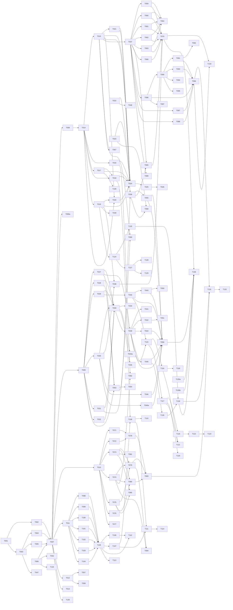

# Tasks: undevops — AI-Native Self-Hosted Deployment Platform

**Input**: Design documents from `specs/001-init/`
**Prerequisites**: plan.md (required), spec.md (required), data-model.md (required), contracts/ (required), quickstart.md (required)

**Tests**: Included per spec acceptance scenarios (US1–US6 have explicit verification criteria).

**Organization**: Tasks grouped by user story for independent implementation and testing. Each task assigned to a specialist agent for domain-aware execution.

## Format: `[ID] [AGENT] [Story?] Description`

- **[AGENT]**: Specialist agent responsible for the task
- **[Story]**: Which user story this task belongs to (US1–US6)
- Include exact file paths in descriptions
- Parallelism derived from Dependency Graph — tasks with no dependencies can run in parallel

## Agent Tags

| Tag | Agent | Domain |
|-----|-------|--------|
| `[SETUP]` | — (orchestrator) | Project init, shared config, scaffolding, rebrand |
| `[DB]` | database-architect | Schema, migrations, seeds, indexes |
| `[BE]` | backend-specialist | API routes, services, middleware, server logic + unit tests |
| `[FE]` | frontend-specialist | Components, pages, styles, client state, UI design + unit tests |
| `[OPS]` | devops-engineer | Docker, CI/CD, infra, deploy configs |
| `[E2E]` | test-engineer | Cross-boundary integration/E2E tests |
| `[SEC]` | security-auditor | Security audit, vulnerability review |

## Task Statuses

| Status | Meaning |
|--------|---------|
| `- [ ]` | Pending |
| `- [→]` | In progress |
| `- [X]` | Completed |
| `- [!]` | Failed |
| `- [~]` | Blocked (cascade from a failed dependency) |

---

## Phase 1: Setup (Shared Infrastructure)

**Purpose**: Rebrand from Dokploy, restructure monorepo, scaffold new packages

- [X] T001 [SETUP] Rename all `package.json` `name` fields from `@dokploy/*` to `@undevops/*` across monorepo
- [X] T002 [SETUP] Update all `workspace:*` references and internal imports (`from "@dokploy/..."` → `from "@undevops/..."`) across all files
- [X] T003 [SETUP] Rename `apps/dokploy/` → `apps/web/` and `apps/schedules/` → `apps/scheduler/`; update `pnpm-workspace.yaml`
- [X] T004 [OPS] Update `docker-compose.yml` and `docker-compose.prod.yml` to reference new app names and image prefixes
- [X] T005 [OPS] Update `.github/workflows/` CI/CD pipelines for new paths, app names, and `@undevops/*` package names
- [X] T006 [SETUP] Update root `README.md`, `LICENSE`, and in-product attribution — preserve Dokploy Apache 2.0 notices per FR-031, SC-007
- [X] T007 [SETUP] Verify full build succeeds after rename: `pnpm install && pnpm build` (gate: blocks all downstream work)
- [X] T008 [SETUP] Verify all existing tests pass after rename: `pnpm test` (gate: confirms no regressions)
- [X] T008a [SETUP] Verify build and tests pass on Windows developer host: `pnpm install && pnpm build && pnpm test` on Windows (FR-032 baseline, SC-009)
- [X] T009 [SETUP] Create `packages/core` skeleton: `package.json` (`@undevops/core`), `tsconfig.json`, `src/index.ts`
- [X] T010 [SETUP] Create `packages/plugin-sdk` skeleton: `package.json` (`@undevops/plugin-sdk`), `tsconfig.json`, `src/index.ts`
- [X] T011 [SETUP] Create `packages/ai-pack` skeleton: `package.json` (`@undevops/ai-pack`), `tsconfig.json`, `src/index.ts`
- [X] T012 [SETUP] Create `apps/mcp-server` skeleton: `package.json` (`@undevops/mcp-server`), `tsconfig.json`, `Dockerfile`, `src/index.ts`
- [X] T013 [SETUP] Create `apps/cli` skeleton: `package.json` (`@undevops/cli`), `tsconfig.json`, commander setup in `src/index.ts`

---

## Phase 2: Foundational (Blocking Prerequisites)

**Purpose**: Core infrastructure that MUST be complete before ANY user story work begins

**⚠️ CRITICAL**: No user story work can begin until this phase is complete (phase = sync barrier)

### Database Schema & Migrations

- [ ] T014 [DB] Add new `pgEnum` types to Drizzle schema in `packages/server/src/db/schema.ts`: `actorType`, `gateStatusType`, `gatePolicyType`, `agentActionType`, `pendingActionStatus`, `mcpAccessLevel`, `mcpTargetType`, `aiProviderType`, `verdictType`, `secretScopeType`
- [ ] T015 [DB] Add `mcp_clients` table to Drizzle schema with SHA-256 token hash, scope, revocation, request counter per data-model.md Migration 002
- [ ] T016 [DB] Add `plugins` table to Drizzle schema with manifest JSON, fault tracking, hook subscriptions per data-model.md Migration 003
- [ ] T017 [DB] Add `ai_reviewers` table to Drizzle schema with provider, credential ref, timeout per data-model.md Migration 004
- [ ] T018 [DB] Add `deployment_review_verdicts` table to Drizzle schema per data-model.md Migration 004
- [ ] T019 [DB] Add `secrets` table to Drizzle schema with AES-256-GCM encrypted value, scope, versioning per data-model.md Migration 005
- [ ] T020 [DB] Add `pending_agent_actions` table to Drizzle schema per data-model.md Migration 006
- [ ] T021 [DB] Enhance `deployment` table: add `initiatingActorType`, `initiatingActorId`, `gateStatus` columns per data-model.md Migration 006
- [ ] T022 [DB] Enhance `environment` table: add `gatePolicy`, `reviewerIds`, `autoApproveAgents` columns per data-model.md Migration 006
- [ ] T023 [DB] Enhance `audit_log` table: add `actor_type`, `actor_id`, `payload` columns + new indexes per data-model.md Migration 006
- [ ] T024 [DB] Create all performance indexes per data-model.md §Indexes for Performance: `mcpClient_tokenHash_idx`, `mcpClient_revokedAt_idx`, `auditLog_actorType_idx`, `auditLog_actorId_idx`, `verdict_deployment_reviewer_unique`, `secret_scope_idx`, `secret_key_unique`, `plugin_enabled_idx`, `pendingAction_status_idx`, `pendingAction_expiresAt_idx`
- [ ] T025 [DB] Generate Drizzle migration files for all schema changes; verify `drizzle-kit generate` produces clean SQL
- [ ] T026 [DB] Write seed data script in `packages/server/src/db/seed.ts` for development: test org, admin user, sample server, project, environment

### Core Extraction

- [ ] T027 [BE] Extract deployment orchestration from `packages/server` → `packages/core/src/deploy/` (build pipeline, Docker integration, health checks)
- [ ] T028 [BE] Extract server management from `packages/server` → `packages/core/src/server-mgmt/` (SSH connectivity, health monitoring, registration)
- [ ] T029 [BE] Extract Traefik/proxy integration from `packages/server` → `packages/core/src/proxy/` (reverse proxy config, TLS, routing)
- [ ] T030 [BE] Extract secret encryption (AES-256-GCM) from `packages/server` → `packages/core/src/secrets/` (encrypt/decrypt/rotate, `UNDEVOPS_ENCRYPTION_KEY` env)
- [ ] T031 [BE] Extract audit event recording from `packages/server` → `packages/core/src/audit/` (structured events, actor attribution, extended action types)
- [ ] T032 [BE] Extract auth core (better-auth) from `packages/server` → `packages/core/src/auth/` (session management). Define pluggable auth interface: `IAuthProvider` with `authenticate(credentials): Promise<Session>`, `authorize(session, resource, action): Promise<boolean>`, `invalidate(sessionId): Promise<void>`. Document extension points for future SSO/RBAC adapters (FR-007)
- [ ] T033 [BE] Update `packages/server` to re-export from `@undevops/core` for backward compatibility during transition
- [ ] T034 [BE] Update all apps (`web`, `api`, `scheduler`) to import from `@undevops/core` directly where appropriate
- [ ] T034a [SETUP] Configure connection pool sizing per app: web(10), api(10), mcp-server(15), scheduler(5), cli(on-demand). Set Postgres max_connections=120. Document connection budget in architecture.md
- [ ] T035 [OPS] Add CI gate: `packages/core` builds without `packages/ai-pack` present (FR-030, SC-005 open-core readiness) in `.github/workflows/ci.yml`

### Auth & Middleware Framework

- [ ] T036 [BE] Implement actor-attributed audit middleware in `packages/core/src/audit/` — records `actor_type` (human/agent/plugin/system) and `actor_id` on every state-changing operation (FR-034 partial, SC-006)
- [ ] T037 [BE] Implement MCP bearer token auth middleware in `apps/mcp-server/src/auth/` — SHA-256 hash lookup against `mcp_clients`, `revoked_at` check, scope extraction (FR-013). On token revocation, middleware MUST signal the SSE transport layer to close all active connections associated with revoked token hash. Implement token-revocation event bus: revocation endpoint publishes event → SSE transport subscribes → closes matching streams. Track requestCount + lastUsedAt in Redis (INCR + timestamp), flush to Postgres every 60s via scheduled job — avoids hot-row lock on auth path under burst traffic.
- [ ] T038 [BE] Implement secret redaction middleware in `apps/mcp-server/src/` — maintain a Set of known secret values in memory; before any MCP/API response serialization, do global `replaceAll(knownSecretValue, '***REDACTED***')` on the serialized JSON string. This value-based global replace catches secrets in any field position, not just known patterns (FR-012, SC-008)

**Checkpoint**: Foundation ready — user story implementation can now begin

---

## Phase 3: US1 - Core Deployment (P1) 🎯 MVP

**Goal**: Solo developer installs undevops on a VPS, deploys a project from git, gets HTTPS in <15 min

**Independent Test**: Fresh Linux VPS → install → connect repo → deploy → verify app responds over HTTPS at configured domain within 15 minutes

### Implementation for US1

- [ ] T039 [BE] [US1] Verify and stabilize Docker orchestration (dockerode + compose) works with `@undevops/core` package names in `packages/core/src/deploy/`
- [ ] T040 [BE] [US1] Verify and stabilize Traefik integration (reverse proxy + TLS via Let's Encrypt) end-to-end in `packages/core/src/proxy/`
- [ ] T041 [BE] [US1] Verify build system (Dockerfile, nixpacks, railpack) works with renamed packages in `packages/core/src/deploy/`
- [ ] T041a [BE] [US1] Implement webhook signature verification (HMAC-SHA256) for GitHub/GitLab/Bitbucket in `apps/api/src/routes/webhooks/` — reject unsigned or invalid-signature webhooks with 401
- [ ] T042 [BE] [US1] Verify server SSH connectivity (SSH2) in `packages/core/src/server-mgmt/`
- [ ] T043 [BE] [US1] Implement zero-downtime deploy: keep previous version healthy until new passes health check in `packages/core/src/deploy/` (FR-006). Hard timeout: if new container doesn't pass health check within 10 minutes, fail deployment, mark it as failed, and unblock deployment queue. Never let queue hang indefinitely.
- [ ] T044 [BE] [US1] Implement real-time log streaming to web UI via SSE in `packages/core/src/deploy/` (FR-004)
- [ ] T045 [BE] [US1] Implement concurrent deployment queue: only one per project, queue collapses to latest commit in `packages/core/src/deploy/`
- [ ] T046 [BE] [US1] Integrate secret encryption at rest (AES-256-GCM) into deployment flow — inject decrypted secrets at runtime, never log values in `packages/core/src/secrets/` (FR-008)
- [ ] T046a [BE] [US1] Implement startup reconciliation: on controller start, compare DB state vs running containers and certificate state, surface discrepancies (crash recovery edge case per spec)
- [ ] T047 [FE] [US1] Rebrand web UI: update logo, name, colors, all Dokploy references → undevops in `apps/web/src/app/` and `apps/web/src/components/`
- [ ] T048 [FE] [US1] Add environment management UI within projects: create, configure (gate policy, reviewers), view deployments in `apps/web/src/components/`
- [ ] T049 [FE] [US1] Add secrets management UI: create, rotate, delete — values never shown after creation in `apps/web/src/components/`
- [ ] T050 [FE] [US1] Update deployment flow UI: select environment, view health check progress, rollback button in `apps/web/src/components/`
- [ ] T051 [FE] [US1] Add server health dashboard: status, resource usage, connected since in `apps/web/src/components/`
- [ ] T052 [FE] [US1] Add version display in UI footer/settings (undevops version, upstream Dokploy version, loaded plugins) in `apps/web/src/components/`
- [ ] T053 [BE] [US1] Implement CLI commands: `server list/add/remove`, `project list/create/deploy`, `deployment list/logs`, `secret set/list`, `env set/list/unset` in `apps/cli/src/commands/` (FR-010)
- [ ] T054 [BE] [US1] Add JSON output format (`--format json`) for all CLI commands in `apps/cli/src/output/`
- [ ] T055 [BE] [US1] Implement audit logging for all US1 state-changing operations (deploy, server add/remove, project create/delete, secret set) in `packages/core/src/audit/` (SC-006)
- [ ] T056 [E2E] [US1] Integration test: fresh server → connect → deploy project → verify HTTPS (acceptance scenario 1–4, SC-001)

**Checkpoint**: User Story 1 should be fully functional and testable independently

---

## Phase 4: US2 - MCP Read Gateway (P1)

**Goal**: AI agent connects via MCP, reads servers/projects/deployments/logs without custom integration code

**Independent Test**: Configure undevops as MCP server in Claude Code → ask it to list deployments → read logs → verify redaction. No glue code.

### Implementation for US2

- [ ] T057 [BE] [US2] Implement stdio transport adapter in `apps/mcp-server/src/transport/` — stdin/stdout JSON-RPC
- [ ] T058 [BE] [US2] Implement SSE transport adapter in `apps/mcp-server/src/transport/` — HTTP `GET /sse` + `POST /messages`, heartbeat every 30s
- [ ] T059 [BE] [US2] Implement `undevops://servers` resource handler (list + detail) in `apps/mcp-server/src/resources/` per contracts/mcp-api.md
- [ ] T060 [BE] [US2] Implement `undevops://projects` resource handler (list + detail with environments) in `apps/mcp-server/src/resources/` per contracts/mcp-api.md
- [ ] T061 [BE] [US2] Implement `undevops://deployments` resource handler (list + detail, paginated) in `apps/mcp-server/src/resources/` per contracts/mcp-api.md
- [ ] T062 [BE] [US2] Implement `undevops://deployments/{id}/logs` resource handler (last N lines, p95 < 500ms) in `apps/mcp-server/src/resources/` per contracts/mcp-api.md (SC-002)
- [ ] T063 [BE] [US2] Implement `undevops://audit` resource handler (paginated, filterable by actor/action/target/time) in `apps/mcp-server/src/resources/` per contracts/mcp-api.md
- [ ] T064 [BE] [US2] Add `undevops://version` resource: undevops version, upstream Dokploy version, loaded plugins per FR-033
- [ ] T065 [BE] [US2] Implement MCP request audit logging: record client ID, resource accessed, timestamp to `audit_log` with `actor_type: "agent"` (FR-014)
- [ ] T066 [BE] [US2] Implement rate limiting per MCP token via Redis sliding window per contracts/mcp-api.md §Rate Limiting
- [ ] T067 [FE] [US2] Add MCP token management page in web UI: create, list (name, scope, prefix, last-used, request count), revoke per FR-013a, FR-013b
- [ ] T068 [FE] [US2] Add audit log viewer page: filterable by actor_type, action, target_resource, time range in `apps/web/src/components/`
- [ ] T069 [BE] [US2] Implement CLI commands: `mcp-tokens create/list/revoke` in `apps/cli/src/commands/`
- [ ] T070 [E2E] [US2] Integration test: MCP client → list servers → read deployment logs → verify value-based secret redaction (known secret values replaced with ``***REDACTED***`` in any field position) → verify < 500ms p95 (acceptance scenarios 1–4, SC-002, SC-008)

**Checkpoint**: User Stories 1 AND 2 should both work independently

---

## Phase 5: US3 - Plugin System (P2)

**Goal**: Platform author writes TypeScript plugin against SDK, installs it, hook fires on next deployment

**Independent Test**: Author "log every deployment event to stdout" plugin → install → trigger deploy → verify hook fired with expected output

### Implementation for US3

- [ ] T071 [BE] [US3] Define `undevops-plugin.json` manifest schema (Zod validation) in `packages/plugin-sdk/src/types/` per contracts/plugin-sdk.md §Plugin Manifest
- [ ] T072 [BE] [US3] Define typed hook payloads: `PreDeployPayload`, `PostDeployPayload`, `DeployFailedPayload`, `ServerAddedPayload`, `ServerRemovedPayload`, `ProjectCreatedPayload`, `ProjectDeletedPayload` in `packages/plugin-sdk/src/types/` per contracts/plugin-sdk.md
- [ ] T073 [BE] [US3] Implement plugin loader in `packages/plugin-sdk/src/host/`: scan directory, validate manifests (Zod), load modules (dynamic import), check SDK version compatibility. Plugins run in-process via dynamic import() — this gives them full Node.js runtime access. Permission system is a UX/administrative boundary, not security sandbox. Document this honestly in plugin-sdk README. Future: investigate Worker threads or subprocess isolation for untrusted plugins.
- [ ] T074 [BE] [US3] Implement hook dispatcher in `packages/plugin-sdk/src/host/`: ordered invocation by priority, error isolation per hook, timeout enforcement, faulted-state tracking (FR-018). Implement crash-loop prevention: track fault count + timestamps per plugin. When plugin faults ≥3 times within rolling 10-minute window, auto-set status='disabled', audit-log auto-disable, and skip subsequent invocations until admin re-enables. Fault counter resets only on explicit re-enable.
- [ ] T075 [BE] [US3] Implement permission system in `packages/plugin-sdk/src/permissions/`: declare in manifest, prompt on install, grant/deny persist to `plugins.grantedPermissions`, runtime enforcement on `PluginApiClient`
- [ ] T076 [BE] [US3] Implement `PluginApiClient` in `packages/plugin-sdk/src/`: scoped, permission-checked API with rate limiting (30 req/min) and timeout (5s)
- [ ] T077 [BE] [US3] Implement plugin test utilities: `createTestContext`, `mockPayload` builders in `packages/plugin-sdk/src/testing.ts` per contracts/plugin-sdk.md §Testing Support
- [ ] T078 [BE] [US3] Write reference plugin: "log every deployment event to stdout" in `plugins/deploy-logger/` with manifest, hook implementation, and package.json
- [ ] T079 [BE] [US3] Integrate plugin host into deployment pipeline: fire `pre-deploy`, `post-deploy`, `deploy-failed` hooks in `packages/core/src/deploy/`
- [ ] T080 [BE] [US3] Integrate plugin host into server/project lifecycle: fire `server-added`, `server-removed`, `project-created`, `project-deleted` hooks in `packages/core/src/server-mgmt/` and project services
- [ ] T081 [BE] [US3] Implement plugin install/list/enable/disable/remove CLI commands in `apps/cli/src/commands/plugins.ts`
- [ ] T082 [FE] [US3] Add plugin management page to web UI: list plugins, status (active/faulted/disabled/failed), permissions, last invoked, enable/disable in `apps/web/src/components/`
- [ ] T083 [E2E] [US3] Integration test: install reference plugin → trigger deploy → verify hook fires (acceptance scenarios 1–2, SC-003)
- [ ] T084 [E2E] [US3] Integration test: plugin throws in hook → verify deployment continues, plugin marked faulted (FR-018, acceptance scenario 3)
- [ ] T085 [E2E] [US3] Integration test: plugin declares permission → user prompted to grant/deny → recorded (FR-019, acceptance scenario 4)

**Checkpoint**: User Stories 1, 2, AND 3 should all work independently

---

## Phase 6: US4 - MCP Write Gateway (P2)

**Goal**: AI agent triggers deploy via MCP with human approval, deployment proceeds with audit trail

**Independent Test**: MCP client with write scope → issue deploy → verify approval gate → approve in UI → deployment proceeds → agent receives structured completion

### Implementation for US4

- [ ] T086 [BE] [US4] Implement `undevops_deploy` MCP tool: validate write scope, create deployment + pending agent action in `apps/mcp-server/src/tools/` per contracts/mcp-api.md
- [ ] T087 [BE] [US4] Implement `undevops_rollback` MCP tool: validate write scope, create rollback + pending action in `apps/mcp-server/src/tools/`
- [ ] T088 [BE] [US4] Implement `undevops_scale` MCP tool: validate exec scope, create scale action in `apps/mcp-server/src/tools/`
- [ ] T089 [BE] [US4] Implement `undevops_inspect_deployment` and `undevops_get_logs` MCP tools for read-scope tool-oriented workflows in `apps/mcp-server/src/tools/`
- [ ] T090 [BE] [US4] Implement pending action queue: store in `pending_agent_actions` table, surface in web UI via tRPC endpoint, auto-expire via `expires_at`
- [ ] T091 [BE] [US4] Implement approval flow: human approves/rejects in UI → action executes → result recorded in audit log with `actor_type: "agent"` (FR-021, FR-022)
- [ ] T092 [BE] [US4] Implement auto-approval policy: configurable per environment (`autoApproveAgents` flag), off by default
- [ ] T093 [BE] [US4] Implement action progress subscription: agent polls or receives SSE events for deployment status (queued → building → deploying → healthy/failed)
- [ ] T094 [BE] [US4] Implement optimistic concurrency: second action on same resource queues; if race detected, return conflict error `-32004`
- [ ] T095 [FE] [US4] Add pending agent actions page in web UI: list pending, approve/reject with optional note, view linked deployment in `apps/web/src/components/`
- [ ] T096 [E2E] [US4] Integration test: MCP write client → deploy → approve → verify completion + audit log (acceptance scenarios 1–4, SC-010)
- [ ] T097 [E2E] [US4] Integration test: write client out of scope → immediate rejection, no pending state, rejection logged (FR-020)

**Checkpoint**: User Stories 1–4 should all work independently

---

## Phase 7: US5 - Multi-AI Review (P3)

**Goal**: Production environment gates deployments through N AI reviewers; deploy proceeds only if all pass or admin overrides

**Independent Test**: Configure 2 AI reviewers for production env → trigger deploy → verify both receive change payload → both write verdicts → deploy waits on gate → override failing review → verify logged with reason

### Implementation for US5

- [ ] T098 [BE] [US5] Implement `AIReviewerProvider` interface in `packages/ai-pack/src/providers/`: `review(payload): Promise<Verdict>` with timeout support
- [ ] T099 [BE] [US5] Implement `ClaudeReviewer` provider in `packages/ai-pack/src/providers/` using Vercel AI SDK → Claude API
- [ ] T100 [BE] [US5] Implement `GeminiReviewer` provider in `packages/ai-pack/src/providers/` using Vercel AI SDK → Gemini API
- [ ] T101 [BE] [US5] Implement `OpenAIReviewer` provider in `packages/ai-pack/src/providers/` using Vercel AI SDK → OpenAI API
- [ ] T102 [BE] [US5] Implement `CodexReviewer` provider in `packages/ai-pack/src/providers/` using Vercel AI SDK → Codex API
- [ ] T103 [BE] [US5] Implement `CustomReviewer` provider for self-hosted/OpenAI-compatible endpoints with configurable `apiUrl` in `packages/ai-pack/src/providers/`
- [ ] T104 [BE] [US5] Implement change payload builder in `packages/ai-pack/src/review/`: diff extraction, env var change detection, compose change detection per FR-024
- [ ] T105 [BE] [US5] Implement gate evaluator in `packages/ai-pack/src/review/`: send to all reviewers in parallel, collect verdicts with per-reviewer `timeoutSeconds`, enforce strict-by-default policy (any FAIL/ABSENT → blocked) per FR-025, FR-025a
- [ ] T106 [BE] [US5] Implement admin override: written reason required, logged to `audit_log` with `action: "gate_bypassed"`, recorded in `deployment_review_verdicts` per FR-025
- [ ] T107 [BE] [US5] Integrate gate into deployment flow: gated environments enter `gateStatus: "pending"` state, evaluator runs, transitions to `approved`/`rejected`/`timed_out` in `packages/core/src/deploy/`
- [ ] T108 [BE] [US5] Persist reviewer responses in `deployment_review_verdicts` table: verdict, reasoning, confidence, payload, duration_ms per FR-026
- [ ] T109 [FE] [US5] Add AI reviewer configuration UI: add/remove reviewers, set timeouts, assign to environments, configure model + provider in `apps/web/src/components/`
- [ ] T110 [FE] [US5] Add review verdict display in deployment detail: per-reviewer verdict, concerns, confidence, timestamps in `apps/web/src/components/`
- [ ] T111 [E2E] [US5] Integration test: 2 reviewers → both PASS → deploy proceeds automatically (acceptance scenarios 1–2)
- [ ] T112 [E2E] [US5] Integration test: 2 reviewers → 1 FAIL → deploy blocked → override with reason → proceeds (acceptance scenario 3)
- [ ] T113 [E2E] [US5] Integration test: reviewer timeout → ABSENT → strict policy blocks deploy (acceptance scenario 4, FR-025a)
- [ ] T114 [E2E] [US5] Performance test: 2 reviewers, ≤200 changed lines → verdicts collected < 60s (SC-004)

**Checkpoint**: User Stories 1–5 should all work independently

---

## Phase 8: US6 - Multi-Server Cluster (P3)

**Goal**: Team adds 2nd/3rd server, deploys with replicas:3, app distributed across cluster, node failure doesn't interrupt service

**Independent Test**: Connect 3 servers → deploy project with 3 replicas → verify distribution → kill 1 node → verify service continues → node rejoins → eligible for placement

### Implementation for US6

- [ ] T115 [BE] [US6] Preserve and verify Dokploy's Docker Swarm integration under `@undevops/*` package names in `packages/core/src/deploy/`
- [ ] T116 [BE] [US6] Implement multi-node replica scheduling: distribute replicas across distinct nodes when `replicas > 1` in `packages/core/src/deploy/` per FR-028
- [ ] T117 [BE] [US6] Implement node health monitoring: periodic check (BullMQ scheduled job), mark degraded/unreachable in `packages/core/src/server-mgmt/` per FR-029
- [ ] T118 [BE] [US6] Implement replica rescheduling: drain from degraded nodes within configurable timeout, reschedule to healthy nodes in `packages/core/src/deploy/` per FR-029
- [ ] T119 [BE] [US6] Update Traefik config for multi-node load balancing: distribute traffic across healthy replicas in `packages/core/src/proxy/`
- [ ] T120 [FE] [US6] Add cluster topology view in web UI: nodes, health, replica placement, resource utilization in `apps/web/src/components/`
- [ ] T121 [E2E] [US6] Integration test: 3 servers → deploy 3 replicas → verify distribution across distinct nodes (acceptance scenario 1, FR-028)
- [ ] T122 [E2E] [US6] Integration test: kill 1 node → replicas reschedule → service continues via load balancer (acceptance scenario 2, FR-029)
- [ ] T123 [E2E] [US6] Integration test: node rejoins → eligible for next deployment placement (acceptance scenario 3)

**Checkpoint**: All 6 user stories should be independently testable

---

## Phase 9: Polish & Cross-Cutting

**Purpose**: Verification, security hardening, backup/restore, and cross-cutting concerns

- [ ] T124 [BE] Implement backup job in `apps/scheduler/src/jobs/`: `pg_dump --single-transaction --format=custom` → AES-256-GCM encrypt → S3 upload via `@aws-sdk/client-s3` per FR-035, FR-036, FR-037. `--single-transaction` ensures atomic snapshot consistency at scale envelope.
- [ ] T125 [BE] Implement restore command in `apps/cli/src/commands/`: download from S3 → decrypt → `pg_restore` to fresh instance per FR-039, SC-011
- [ ] T126 [OPS] Schedule backup via BullMQ in `apps/scheduler/`: default every 6 hours, configurable per FR-035
- [ ] T127 [BE] Add backup status endpoint: last success timestamp, last attempt, last error per FR-038
- [ ] T128 [FE] Add backup configuration UI: S3 settings, schedule, manual trigger, status display per FR-038
- [ ] T129 [BE] Add backup status MCP resource: `undevops://backup-status` per FR-038
- [ ] T130 [E2E] Integration test: configure backup → trigger → verify S3 upload → restore to fresh instance < 30 min (SC-011, SC-013)
- [ ] T131 [E2E] Regression: all Wave 1 + Wave 2 tests pass after Wave 3 changes
- [ ] T132 [E2E] Load test at scale envelope: 50 servers, 500 projects, 30 replicas, 30-day retention — verify no non-linear degradation (SC-012)
- [ ] T133 [SEC] Security audit: verify no secret values in MCP responses, AI reviewer payloads, audit log free-text, application logs (SC-008)
- [ ] T134 [SEC] Security audit: verify Apache 2.0 attribution in all distributed artifacts (SC-007)
- [ ] T135 [E2E] Verify cross-platform dev: build + test on Windows, macOS, Linux from single documented procedure (SC-009)
- [ ] T135a [OPS] Implement deployment log rotation: compress (gzip) + upload to S3 after deployment finishes; delete local file after 24h grace; update deployment.logUri to S3 path; MCP logs endpoint fetches from S3 if local missing. BullMQ scheduled job for cleanup. (scale envelope: controller disk stays under 50GB at 30-day sustained load)
- [ ] T135b [BE] Implement audit-log tamper-evidence: REVOKE UPDATE/DELETE on audit_log from application role; add hash chain column (SHA-256 of previous row hash + own data); periodic integrity-scan job verifies chain; alert admin on break
- [ ] T136 [OPS] Run quickstart.md validation: follow guide end-to-end on fresh VPS, verify < 15 min (SC-001)

---

## Dependency Graph

### Legend

- `→` means "unlocks" (left must complete before right can start)
- `+` means "all of these" (join point — ALL listed tasks must complete)
- Tasks not listed here have no dependencies and can start immediately within their phase

### Dependencies

T001 → T002, T003
T002 → T007
T003 → T004, T005
T004 + T005 + T006 → T007
T007 → T008, T008a, T009, T010, T011, T012, T013
T008 → T014
T009 → T027, T028, T029, T030, T031, T032
T014 → T015, T016, T017, T018, T019, T020
T015 → T021, T024
T015 + T019 → T020
T017 → T018
T015 + T016 + T017 + T018 + T019 + T020 + T021 + T022 + T023 → T024
T024 → T025
T025 → T026
T027 + T028 + T029 + T030 + T031 + T032 → T033
T033 → T034, T035
T021 + T031 → T036
T015 → T037
T019 + T030 → T038
T027 + T033 → T039
T029 → T040
T039 → T041, T041a, T042
T041 → T041a
T040 → T043
T039 → T044, T045
T030 + T039 + T043 + T014 → T046a
T030 → T046
T003 → T047
T022 → T048
T019 → T049
T043 → T050
T042 → T051
T006 → T052
T009 + T027 + T028 → T053
T053 → T054
T036 → T055
T039 + T040 + T043 + T044 + T045 + T046 + T046a + T055 → T056
T012 → T057, T058
T037 → T059, T060, T061, T062, T063
T059 + T060 + T061 + T062 + T063 → T064
T037 + T036 → T065
T037 → T066
T015 → T067
T023 + T036 → T068
T053 + T015 → T069
T059 + T060 + T061 + T062 + T063 + T038 + T065 + T066 → T070
T010 → T071, T072, T073, T074, T075, T076, T077
T071 + T072 → T078
T073 + T074 + T075 → T079, T080
T073 → T081
T074 + T016 → T082
T078 + T079 + T080 → T083
T074 + T079 → T084
T075 + T073 → T085
T037 → T086, T087, T088, T089
T086 → T090
T090 → T091
T091 → T092
T090 → T093, T094
T090 → T095
T086 + T087 + T088 + T091 + T093 → T096
T086 → T097
T011 → T098, T099, T100, T101, T102, T103, T104
T098 + T099 + T100 + T101 + T102 + T103 → T105
T104 → T105
T105 → T106
T105 → T107
T018 → T108
T107 → T108
T017 → T109
T108 → T110
T107 + T108 → T111
T106 + T105 → T112
T105 → T113
T111 → T114
T039 + T040 → T115
T115 → T116, T117
T117 → T118
T116 → T119
T117 → T120
T116 + T117 → T121
T118 → T122
T122 → T123
T019 → T124
T124 → T125
T045 → T126
T124 → T127
T127 → T128, T129
T125 + T126 → T130
T083 + T096 + T130 → T131
T131 → T132
T070 + T096 → T133
T006 → T134
T007 → T135
T056 + T070 + T130 + T135a + T135b → T136

### Self-Validation Checklist

> - [X] Every task ID in Dependencies exists in the task list above
> - [X] No circular dependencies (A→B→A)
> - [X] No orphan task IDs referenced that don't exist
> - [X] Fan-in uses `+` only, fan-out uses `,` only
> - [X] No chained arrows on a single line

---

## Dependency Visualization

> Auto-generated from Dependencies section above. For visual rendering in GitHub/VS Code only — NOT for parsing by the orchestrator.

---

## Parallel Lanes

| Lane | Agent Flow | Tasks | Blocked By |
|------|-----------|-------|------------|
| 1 | [SETUP] | T001 → T002, T003 → T007 → T008 | — |
| 2 | [SETUP] scaffolding | T009, T010, T011, T012, T013 | T007 |
| 3 | [DB] | T014 → T015, T016, T017, T018, T019, T020 → T021, T022, T023 → T024 → T025 → T026 | T008 |
| 4 | [BE] core extraction | T027, T028, T029, T030, T031, T032 → T033 → T034, T035 | T009 |
| 5 | [BE] auth/middleware | T036, T037, T038 | T021 + T031, T015, T019 + T030 |
| 6 | [BE] [US1] deploy | T039, T040 → T041, T042 → T043, T044, T045, T046, T046a → T055 → T056 | T027 + T033, T029 |
| 7 | [FE] [US1] UI | T047, T048, T049, T050, T051, T052 | T003, T022, T019, T043, T042, T006 |
| 8 | [BE] [US1] CLI | T053 → T054 | T009 + T027 + T028 |
| 9 | [BE] [US2] MCP transport | T057, T058 | T012 |
| 10 | [BE] [US2] MCP resources | T059, T060, T061, T062, T063 → T064, T065, T066 → T070 | T037 |
| 11 | [FE] [US2] UI | T067, T068 | T015, T023 + T036 |
| 12 | [BE] [US2] CLI | T069 | T053 + T015 |
| 13 | [BE] [US3] SDK types | T071, T072, T073, T074, T075, T076, T077 → T078 → T079, T080 → T083, T084, T085 | T010 |
| 14 | [BE] [US3] CLI + UI | T081, T082 | T073, T074 + T016 |
| 15 | [BE] [US4] MCP tools | T086, T087, T088, T089 → T090 → T091 → T092, T093, T094, T095 → T096, T097 | T037 |
| 16 | [BE] [US5] AI providers | T098, T099, T100, T101, T102, T103, T104 → T105 → T106, T107 → T108 → T111, T112, T113, T114 | T011 |
| 17 | [FE] [US5] UI | T109, T110 | T017, T108 |
| 18 | [BE] [US6] cluster | T115 → T116, T117 → T118, T119, T120 → T121, T122, T123 | T039 + T040 |
| 19 | [BE] backup/restore | T124 → T125, T126, T127 → T128, T129 → T130 | T019, T045 |
| 20 | [OPS] CI/infra | T004, T005, T035, T126, T134, T135, T136 | T003, T033, T007, T006 |
| 21 | [E2E] verification | T056, T070, T083, T084, T085, T096, T097, T111, T112, T113, T114, T121, T122, T123, T130, T131, T132 | domain tasks |
| 22 | [SEC] audit | T133, T134 | T070 + T096, T006 |

---

## Agent Summary

| Agent | Task Count | Can Start After |
|-------|-----------|-----------------|
| [SETUP] | 15 | immediately |
| [DB] | 13 | T008 |
| [BE] | 77 | T007/T009/T015 (varies by task) |
| [FE] | 13 | T003/T019/T022/T043 (varies by task) |
| [OPS] | 8 | T003/T007 (varies by task) |
| [E2E] | 17 | domain agent completion gates |
| [SEC] | 2 | T070 + T096 complete |

**Critical Path**: T001 → T002 → T007 → T008 → T014 → T015 → T019 → T124 → T125 + T126 → T130 + T056 + T070 → T136 (13 hops)

---

## Agent Dispatch Plan

| Agent | Subagent | Skills | Input Context | Tasks | Files |
|-------|----------|--------|---------------|-------|-------|
| `[SETUP]` | — (orchestrator) | — | plan.md §Project Structure, §Phase 0 | T001–T013 | `package.json`, `pnpm-workspace.yaml`, `tsconfig.json`, project root |
| `[DB]` | `database-architect` | `database-design` | data-model.md (full), plan.md §1.3 | T014–T026 | `packages/server/src/db/`, migration files |
| `[BE]` | `backend-specialist` | `api-patterns`, `system-design-patterns` | data-model.md §entities, contracts/, plan.md §tech-stack, quickstart.md | T027–T054, T057–T066, T069, T071–T081, T086–T094, T098–T108, T115–T119, T124–T127, T129 | `packages/core/src/`, `packages/server/src/`, `packages/plugin-sdk/src/`, `packages/ai-pack/src/`, `apps/mcp-server/src/`, `apps/cli/src/`, `apps/scheduler/src/` |
| `[FE]` | `frontend-specialist` | `react-patterns`, `tailwind-patterns`, `frontend-design` | contracts/ §MCP resources, plan.md §UI framework | T047–T052, T067, T068, T082, T095, T109, T110, T120, T128 | `apps/web/src/app/`, `apps/web/src/components/`, `apps/web/src/trpc/` |
| `[OPS]` | `devops-engineer` | `deployment-procedures` | plan.md §infra, quickstart.md, docker/ | T004, T005, T035, T126, T134, T135, T136 | `docker/`, `.github/workflows/`, `Dockerfile` |
| `[E2E]` | `test-engineer` | `testing-patterns`, `webapp-testing` | contracts/, spec.md §acceptance scenarios, quickstart.md §scenarios | T056, T070, T083, T084, T085, T096, T097, T111, T112, T113, T114, T121, T122, T123, T130, T131, T132 | `tests/contract/`, `tests/integration/`, `tests/e2e/` |
| `[SEC]` | `security-auditor` | `vulnerability-scanner` | spec.md §security (FR-008, FR-012, FR-031), plan.md §auth | T133, T134 | project-wide scan |

---

## Implementation Strategy

### MVP First (User Story 1 Only)

1. Complete Phase 1: Setup (T001–T013)
2. Complete Phase 2: Foundational (T014–T038) — CRITICAL sync barrier
3. Complete Phase 3: User Story 1 (T039–T056)
4. **STOP and VALIDATE**: Test US1 independently — fresh VPS → deploy → HTTPS < 15 min
5. Deploy/demo if ready

### Incremental Delivery

1. Setup + Foundational → Foundation ready
2. Add US1 → Test independently → Deploy/Demo (MVP!)
3. Add US2 → Test independently → MCP read gateway live
4. Add US3 → Test independently → Plugin system available
5. Add US4 → Test independently → MCP write with approval
6. Add US5 → Test independently → AI review gates
7. Add US6 → Test independently → Multi-server cluster
8. Each story adds value without breaking previous stories

### Parallel Agent Strategy (Claude Code)

1. Orchestrator completes Setup phase directly (T001–T013)
2. Once Setup complete (sync barrier) → dispatch parallel agents:
   - Lane 3 `[DB]`: database-architect handles all schema + migrations (T014–T026)
   - Lane 4 `[BE]`: backend-specialist handles core extraction (T027–T035) after DB schema ready
   - Lane 20 `[OPS]`: devops-engineer handles CI/CD independently (T004, T005)
3. As agents complete → unblock dependent lanes:
   - `[BE]` starts US1 deployment tasks (T039–T046) after core extraction
   - `[FE]` starts UI tasks (T047–T052) as their dependencies clear
   - `[BE]` starts MCP transport (T057–T058) after mcp-server skeleton
4. US3 (plugin SDK) is independent from US2 (MCP read) — can parallelize
5. US4 (MCP write) depends on US2 patterns but can start after US2 resources are done
6. US5 and US6 are independent of each other — parallelize in Wave 3
7. `[E2E]` starts when both BE and FE are ready for each story
8. `[SEC]` runs after all story tasks complete

### Multi-Session Strategy (Gemini / Copilot)

1. Complete Setup + Foundational sequentially
2. Use Agent Summary to decide role context switching
3. Optionally launch parallel sessions per agent lane manually
4. Follow Dependency Graph for correct execution order

---

## Notes

- `[AGENT]` tag assigns responsibility — domain agent writes both code and unit tests
- `[E2E]` only for cross-boundary tests — unit tests stay with domain agent
- `[SEC]` runs after domain work — security audit, not security implementation
- Phases are sync barriers — all tasks in a phase must complete/fail/block before next phase
- Each user story is independently completable and testable
- Commit after each task or logical group
- Stop at any checkpoint to validate story independently
- Avoid: vague tasks, same file conflicts, cross-story dependencies that break independence
